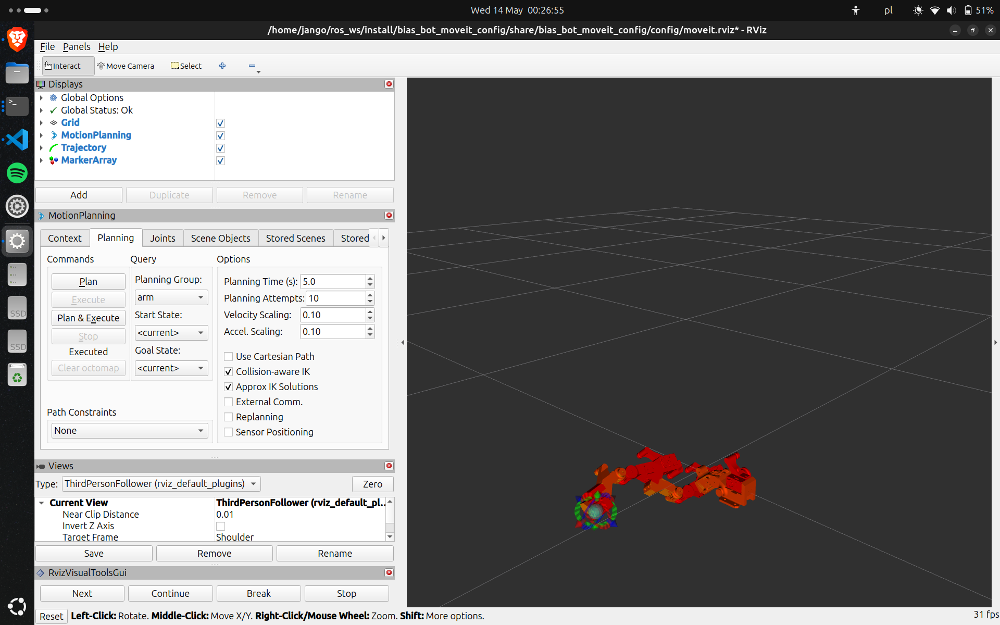

# MoveIt2 simulation

## How 2 use?
1. Install MoveIt2 packages:
    * https://moveit.picknik.ai/main/doc/tutorials/getting_started/getting_started.html

2. Create URDF robot description files (some additional changes to the URDF files are needed):
    * https://apps.autodesk.com/FUSION/en/Detail/Index?id=5028052292896011577&appLang=en&os=Win64
    * https://github.com/bionicdl-sustech/ACDC4Robot

3. Clone this github repo to your ROS2 workspace (`~/ros_ws/src`):
    ```bash
    cd ~/ros_ws/src
    git clone git@github.com:jango175/moveit_bot.git
    ```

3. Create your own MoveIt2 simulation package based on the URDF robot description:
    * https://moveit.picknik.ai/main/doc/examples/setup_assistant/setup_assistant_tutorial.html

4. Build and run the simulation:
    ```bash
    cd ~/ros_ws
    colcon build --mixin release
    source install/setup.bash
    ros2 launch bias_bot_moveit_config demo.launch.py
    ```

5. Configure the simulation in RViz:
    * in `MotionPlanning`
        * in `Planned Path` untick the `Loop Animation` field
        * in `Options`
            * tick `Collision-aware IK` field
            * tick `Approx IK Solutions` field
    * add `Trajectory` pannel
    * add `MarkerArray` pannel
        * change `Topic` to `rviz_visual_tools`
    * add new `RvizVisualToolsGui` panel
    * save the changes with `Ctrl+s`

    

6. Launch the controller for the desired robot:
    * for tests use panda robot:
        ```bash
        source install/setup.bash
        ros2 launch moveit_controller panda_moveit_controller.launch.py
        ```

    * for final robot:
        ```bash
        source install/setup.bash
        ros2 launch moveit_controller bias_bot_moveit_controller.launch.py
        ```
